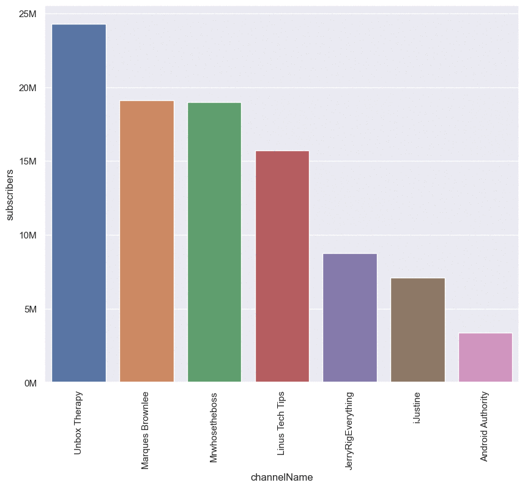

# Data Insider: YouTube Tech channels data analysis with YouTube API

## Contents
1. Introduction
2. Objectives
3. Steps involved 
4. Data acquisition
5. Preprocessing and Feature Engineering
6. Exploratory Data Analysis
7. Conclusions and future research ideas

## 1. Introduction
Have you ever wondered how YouTube Analytics works? How a Youtube channel grows? How a youtuber creates content related to trending topics? How YouTube shows trending videos? How to check your channel’s progress? How to check the statistics namely subscribers, views, comments, etc of any channel?

So, let's answer these questions through data.

In this project, we shall explore the statistics of 7 YouTube tech channels. *(based on my interest)*

## 2. Objectives

Within this project, I would like to explore the following:

- Getting to know Youtube API and how to obtain video data.
- Analyzing video data and verify different common "myths" about what makes a video do well on Youtube, for example:
    - Does the number of likes and comments matter for a video to get more views?
    - Does the video duration matter for views and interaction (likes/ comments)?
    - Does title length matter for views?
    - How many tags do good performing videos have? What are the common tags among these videos?
    - Across all the creators I take into consideration, how often do they upload new videos? On which days in the week?
- Explore the trending topics using NLP techniques
    - Which popular topics are being covered in the videos (e.g. using wordcloud for video titles)?
    - Which questions are being asked in the comment sections in the videos

## 3. Steps involved
1. Extract video meta data via Youtube API for the interested tech channels 
    * Get creditionals from API
    * Request data
    * Transforming it into dataframe  
2. Data Preprocessing
3. Exploratory data analysis
4. Conclusions & insights

## 4. Data Acquisition

### 7 Biggest Tech Channels in the YouTube History
        
        Unbox Therapy 
        MrWhoseTheBoss
        MKBHD
        LinusTechTips
        JerryRigEverything
        iJustine
        Android Authority

## 5. Preprocessing and Feature Engineering

For more information on preprocessing steps click [here](./analysis_of_tech.ipynb)

## 6. Exploratory Data Analysis
### Demo: 

## 7. Conclusions
In this project, we have explored the video data of the 7 most popular Tech channels and revealed many interesting findings for anyone who are starting out with a Youtube channel in Technology sector:

- The more likes and comments a video has, the more views the video gets (it is not guaranteed that this is a causal relationship, it is simply a correlation and can work both way). Likes seem to be a better indicator for interaction than comments and the number of likes seem to follow the "social proof", which means the more views the video has, the more people will like it.

- Most viewed videos tend to be less than 20 minutes.

- Most videos have between 5 and 30 tags.

- Most-viewed videos tend to have average title length of 20-40 characters. Too short or too long titles seem to harm viewership.

- Videos are usually uploaded on Wednesdays and Thursdays. Weekends and Sunday in particular is not a popular time for posting new videos.

- We can notice that a plethora of video titles tend to start with "Tech, Unboxing, Review" words which align with the category of videos.

*****************